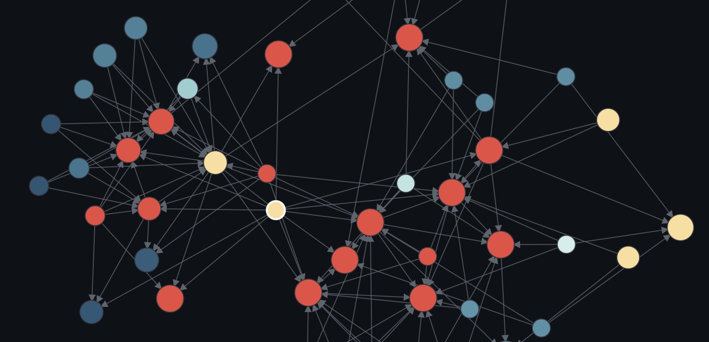
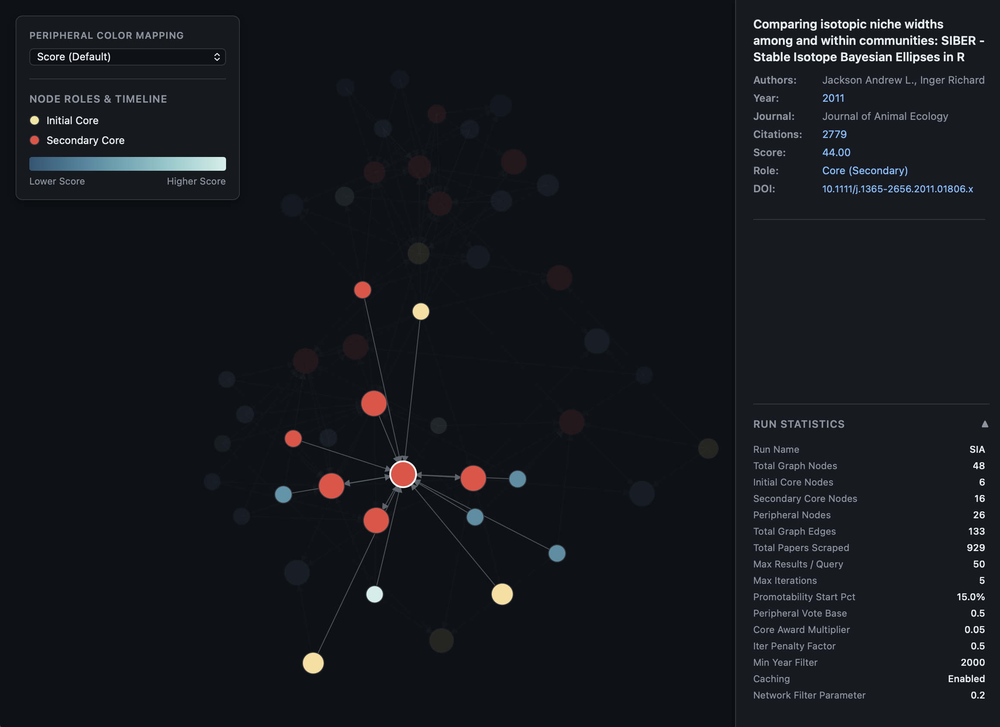

# Citation Network Constructor

An automated pipeline that constructs, filters, and visualizes thematically interconnected academic publication networks using DOIs and network techniques. Built in Python and D3.js. Find real articles, no LLM hallucination. 

Try the [demo](https://zzzhehao.github.io/citation-network/SIA_network.html).

## How Does it Work

The input is really simple. A few paper DOIs from the topic you are trying to get into, they are treated as the *initial core papers*. 

The program looks at the publication citing, or cited by your inputs, they are called as the *peripheral papers*. The "importance" of the peripheral papers will be evaluated by how well they are connected with each others, especially to the cores. Potential *secondary core papers* might be assigned, and the process will be repeated for the new cores, until it finds no more new cores, or the maximum iteration is reached. 

When the search is finished, the core and the most adjacent peripheral papers will be mapped into a network, hopefully showing you a bigger picture of the topic you are trying to get into. The network is visualized by D3.js, so you can click on them, take a look at the basic metadata, or go read them. 

I find the most valuable use of this is to find the real "cores" of the topic from just a few input papers. And to find more papers using that knowledge further. 



## Get Started

### Disclaimer

This tool interfaces with the CrossRef and Semantic Scholar APIs. While internal safeguards are implemented to manage request volume, users are solely responsible for their API usage.

Excessive scraping can lead to temporary or permanent IP blocking by these service providers. Please act responsibly:

- Respect the rate limits of the respective APIs.
- Avoid running unnecessarily large recursive searches.
- Use this software at your own risk. The author assumes no liability for any service interruptions, API bans, or misuse of this software by third parties.

### Installation

1. Copy this repository:
    ```shell
    git clone https://github.com/zzzhehao/citation-network.git
    ```
2. Navigate to the repository directory:
    ```shell
    cd citation-network
    ```
3. Create a virtual environment: 
    ```shell
    python3 -m venv venv
    ```
4. Activate it: 

   Mac/Linux:
    ```shell
    source venv/bin/activate
    ```
   Windows:
    ```shell
    venv\Scripts\activate
    ```
5. Install dependencies: 
    ```shell
    pip install -r requirements.txt
    ```

### Input Methods

You must provide seed DOIs using one of the following methods:

* **Positional Arguments:** Provide DOIs separated by spaces.
  ```shell
  python3 main.py 10.1038/nature12373 10.1038/ncomms11901
  ```
* **--dois:** Provide DOIs as a single comma-separated string.
  ```shell
  python3 main.py --dois "10.1038/nature12373,10.1038/ncomms11901"
  ```
* **-i, --input:** Pass a `.txt` file (one DOI per line) or a `.bib` (BibTeX) file. 
  ```shell
  python3 main.py -i my_papers.bib
  ```

### Run the demo yourself

```python
python3 main.py -i example.bib --recursive-threshold 0.15 --penalty-factor 0.5 --core-award 0.05
```

### Export & Output Settings

* **--run-name**: Customize the basename of output files.
* **--output-dir**: Defines the folder where results are saved. *Default: ./output*.
* **--no-csv**: Skip exporting the `publications.csv` file.
* **--no-json**: Skip exporting the raw `network.json` data structure.

### Network Filtering & API Parameters

* **--min-year**: Drops any publication published before this year. *Default: 2000*
* **--max-results**: The maximum number of cited/citing papers to request per API call per seed paper. Exhaustive searches cause massive API rate-limiting and generate cluttered graphs. Capping this targets the most relevant connections. *Default: 50*
* **--network-filter**: Controls how stronly the peripheral papers are filtered out in final graphs. *Default: 0.2*.

### Recursive Expansion Logic

The tool recursively expands its search by turning highly interconnected peripheral papers into "Secondary Core" papers and deep-scraping their references. The algorithm evaluates a candidate paper's "Score" based on its topology:

* **--max-iterations**: How many deep-dive cycles the scraper should run. *Default: 5* 
* **--peripheral-vote**: The fractional score contribution of a non-core (peripheral) edge. Allows clusters of peripheral papers to surface a secondary core paper. *Default: 0.5*
* **--recursive-threshold**: The baseline percentage of the *current* core network that a candidate paper's score must exceed to be upgraded to a Secondary Core paper. *Default: 0.25 (25%)*
* **--penalty-factor**: Applies an asymptotic decay curve to prevent a "snowball effect" explosion in later iterations. It determines how much of the remaining gap to 100% is available after each iteration. *Default: 0.2 (20%)* 
* **--core-award**: Apply extra points for peripheral papers connected to core papers based on the core paper's score. *Default: 0.05, must be in range 0 - 0.2*
* **--force-large-core**: By default, the program stops if you provide >50 initial seed papers to prevent API bans. Use this flag to override the safeguard. 

In general, if you want to find as many papers as you can, try to increase --penalty-factor, --core-award, or decrease --recursive-threshold. If the program complained about finding too many new cores, try to decrease --core-award, --penalty-factor, or increase --recursive-threshold. 

But please be aware, that there's no universal rule or values that work for every scenario. The best setting depends on how many input papers you have, and how tight they are really connected within the topic you are presenting with those initial papers. Simply throwing a bunch of papers with potentially irrelevant connections might lead to an overwhelming or little informative network. 

Generally, I recommend starting with the default values and adjusting them based on your specific use case. Usually core award should not exceed 0.1, otherwise the number of new cores probably will explode at certain point. If you get warning that new cores are too many, reduce the core award will solve most of the problems. 

### Display & Developer Flags

* **--no-report**: Disables the statistical operational report printed in the terminal.
* **--verbose**: Enables diagnostic Python logging.
* **--debug**: Enables a local SQLite cache (`requests-cache`). API responses will be saved locally for 7 days so repeated runs execute instantly.